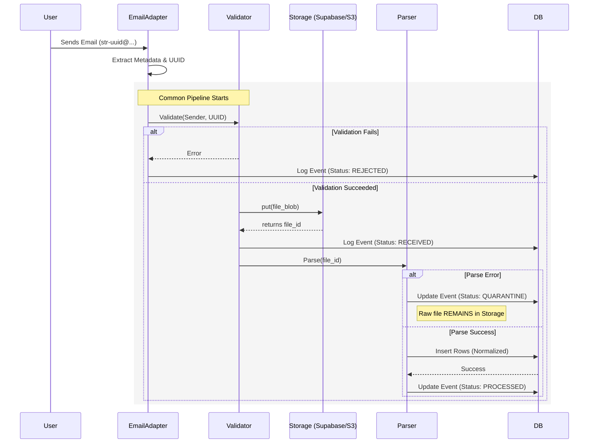
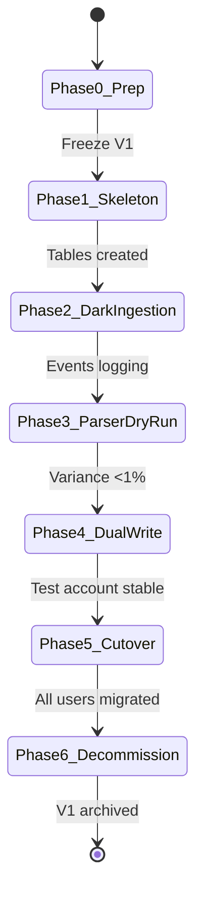

# PRODUCT REQUIREMENTS DOCUMENT (PRD)

**Product:** Saddle AdPulse  
**Module:** Dual-Play Ingestion Infrastructure (Email-First, API-Ready)  
**Document Type:** Master Infrastructure Spec & Migration Plan  
**Version:** 1.2 (Frozen for Build)  
**Owner:** Founder  
**Status:** **APPROVED FOR EXECUTION**

---

## TABLE OF CONTENTS

1. [Purpose & Scope](#1-purpose--scope)
2. [Guiding Principles](#2-guiding-principles-non-negotiable)
3. [Definitions](#3-definitions--terminology)
4. [System Overview & Architecture](#4-system-overview--architecture)
5. [Supported Ingestion Sources](#5-supported-ingestion-sources)
6. [Account Identification & Security](#6-account-identification--security-model)
7. [Email Ingestion Adapter (Phase 1)](#7-email-ingestion-adapter-phase-1)
8. [API Ingestion Adapter (Future)](#8-api-ingestion-adapter-future)
9. [Validation Layer](#9-validation-layer-source-agnostic)
10. [Raw File Storage Layer](#10-raw-file-storage-layer)
11. [Parsing Engine & Field Mapping (Technical Spec)](#11-parsing-engine--field-mapping-technical-spec)
12. [Normalized Data Load & Schema (Technical Spec)](#12-normalized-data-load--schema-technical-spec)
13. [Ingestion History & Auditability](#13-ingestion-history--auditability)
14. [Schedule Detection & Monitoring](#14-schedule-detection--monitoring)
15. [Failure Handling & Quarantine](#15-failure-handling--quarantine)
16. [Alerting & Notifications](#16-alerting--notifications)
17. [Manual Upload (Fallback)](#17-manual-upload-fallback-path)
18. [Data Retention](#18-data-retention--purge-policy)
19. [Access Control](#19-access-control--user-visibility)
20. [Non-Goals](#20-non-goals)
21. [Phased Delivery Plan](#21-phased-delivery-plan)
22. [Success Metrics](#22-success-metrics)
23. [Change Control Rules](#23-change-control-rules)
24. [**APPENDIX: MIGRATION & EXECUTION STRATEGY (MANDATORY)**](#24-appendix-migration--execution-strategy-mandatory)

---

## 1. PURPOSE & SCOPE

### Purpose
To define a single ingestion infrastructure that:
- Works today via email.
- Supports Amazon API ingestion later.
- Guarantees traceability, replayability, and data integrity.
- **Coexists safely with the legacy system during migration.**

### Scope
- **Includes:** Ingestion, Validation, Storage, Parsing, Loading, Alerting, Retention.
- **Excludes:** Optimization logic, Impact modeling, UI design beyond ingestion visibility.

---

## 2. GUIDING PRINCIPLES (NON-NEGOTIABLE)

1. **Adapters are swappable.** Core logic is not.
2. **No data is ever discarded silently.**
3. **Failures alert operators before users.**
4. **Raw data must always be recoverable.**
5. **Email is a transport, not a dependency.**
6. **Every ingestion is auditable.**

---

## 3. DEFINITIONS & TERMINOLOGY

| Term | Definition |
|------|------------|
| **Ingestion Event** | One attempt to process a report. |
| **Raw File** | Original CSV as received (immutable). |
| **Adapter** | Source-specific ingestion mechanism (Email vs API). |
| **Validation** | Identity + structure checks *before* parsing. |
| **Quarantine** | Stored but unprocessed file due to errors. |
| **Shadow Mode** | Running V2 logic without user visibility or database overwrites. |

---

## 4. SYSTEM OVERVIEW & ARCHITECTURE

### Conceptual Flow
```
SOURCE → Adapter → Validator → Raw Store → Parser → DB
```

### Logic Flow (Sequence Diagram)
*Developers: Use this logic to structure the async pipeline.*



---

## 5. SUPPORTED INGESTION SOURCES

**Enum (Required):** `IngestionSource`

```python
class IngestionSource(Enum):
    EMAIL = "EMAIL"
    API = "API"
    MANUAL = "MANUAL"
```

---

## 6. ACCOUNT IDENTIFICATION & SECURITY MODEL

### Identifier Strategy
- System-generated UUID per account.
- Used as email local-part.
- Format: `str-{uuid}@ingest.saddle.ai`

### Validation Logic
**PASS if:**
1. `recipient_identifier` maps to an active account
2. **AND** `sender_email` ∈ `allowed_sender_emails` (stored in Account Settings)

---

## 7. EMAIL INGESTION ADAPTER (PHASE 1)

### Responsibilities
1. Receive email.
2. Extract metadata (Sender, Timestamp, Subject).
3. Save attachment to memory.
4. Pass payload to **Validation Layer**.

> [!WARNING]
> ### CRITICAL: The "Email Fork" Rule
> During migration, V2 must receive a **copy** of the email independent of V1.
> 
> **Implementation:** Configure email provider (SES/Gmail) to forward a copy to a dedicated V2 address/alias. V2 must not "steal" emails from the V1 inbox.

---

## 8. API INGESTION ADAPTER (FUTURE)

### Responsibilities
1. Authenticate with Amazon.
2. Fetch STR data.
3. Pass payload to **Validation Layer** (Identical structure to Email Adapter).

---

## 9. VALIDATION LAYER (SOURCE-AGNOSTIC)

### Validation Types
1. **Identity:** (Does UUID exist? Is Sender Whitelisted?)
2. **Structural:** (Is file empty? Is it UTF-8 readable?)

> [!IMPORTANT]
> **Rule:** Validation happens *before* parsing. Failures are Logged, Quarantined, and Alerted.

---

## 10. RAW FILE STORAGE LAYER

### Abstraction Interface (MANDATORY)

```python
# Interface Definition
def put(file_object, metadata: dict) -> str:
    """Store file, return file_id"""
    pass

def get(file_id: str) -> bytes:
    """Retrieve file by ID"""
    pass
```

**Phase 1:** Supabase Storage.

> [!IMPORTANT]
> **Rule:** Business logic must not reference the storage provider directly.

---

## 11. PARSING ENGINE & FIELD MAPPING (TECHNICAL SPEC)

> [!WARNING]
> ### Resource Isolation Rule
> The Parsing Engine must run on a **separate worker queue** (e.g., `celery_queue_v2`) to ensure CPU/Memory spikes during V2 backfills do not starve the production V1 system.

### Mapping Logic (Strict Mode)
The parser must look for these Amazon Headers. If a **Required** header is missing, fail the file.

| Amazon Header (Variations) | Internal Field | Type | Required? |
|----------------------------|----------------|------|-----------|
| `Date`, `Day` | `report_date` | DATE | **YES** |
| `Campaign Name` | `campaign_name` | STRING | **YES** |
| `Ad Group Name` | `ad_group_name` | STRING | **YES** |
| `Customer Search Term` | `search_term` | STRING | **YES** |
| `Impressions` | `impressions` | INT | **YES** |
| `Clicks` | `clicks` | INT | **YES** |
| `Spend` | `spend` | DECIMAL(10,2) | **YES** |
| `7 Day Total Sales` | `sales_7d` | DECIMAL(10,2) | NO (Default 0) |

---

## 12. NORMALIZED DATA LOAD & SCHEMA (TECHNICAL SPEC)

> [!WARNING]
> ### Table Isolation Rule
> During migration phases, V2 must write to **distinct tables** (`_v2` suffix) to prevent Unique Constraint collisions and index locking on the live production tables.

### Target Schema (MVP)

**Table:** `search_terms_v2`

| Column | Type | Notes |
|--------|------|-------|
| `id` | UUID | Primary Key |
| `account_id` | UUID | Foreign Key to `accounts` |
| `ingestion_id` | UUID | Foreign Key to `ingestion_events` |
| `report_date` | DATE | From CSV |
| `campaign_name` | VARCHAR | From CSV |
| `ad_group_name` | VARCHAR | From CSV |
| `search_term` | VARCHAR | From CSV |
| `impressions` | INT | |
| `clicks` | INT | |
| `spend` | DECIMAL(10,2) | |
| `sales_7d` | DECIMAL(10,2) | |
| `created_at` | TIMESTAMPTZ | Default NOW() |

---

## 13. INGESTION HISTORY & AUDITABILITY

**Table:** `ingestion_events_v2`

| Column | Type | Notes |
|--------|------|-------|
| `ingestion_id` | UUID | PK |
| `account_id` | UUID | FK |
| `source` | ENUM | `EMAIL`, `API`, `MANUAL` |
| `status` | ENUM | `RECEIVED`, `PROCESSING`, `COMPLETED`, `FAILED` |
| `failure_reason` | TEXT | Nullable |
| `raw_file_path` | VARCHAR | Reference to storage |
| `received_at` | TIMESTAMPTZ | |
| `processed_at` | TIMESTAMPTZ | |
| `metadata` | JSONB | Sender, filename, row counts |

---

## 14. SCHEDULE DETECTION & MONITORING

- **Learning Mode:** First 3 successful ingestions establish the baseline.
- **Alert Rule:** Mark "Late" if `Now > (Last_Ingestion + Expected_Interval + 12 Hours)`.

---

## 15. FAILURE HANDLING & QUARANTINE

### Failure Flow
```
FAIL → Store raw file → Log event (Status: QUARANTINE) → Alert Operator → Await Action
```

### Operator Actions
| Action | Description |
|--------|-------------|
| **Reprocess** | Re-run parser on same raw file |
| **Discard** | Mark as permanently failed |

---

## 16. ALERTING & NOTIFICATIONS

### Severity Matrix

| Severity | Condition | Channel |
|----------|-----------|---------|
| **Critical** | System-wide failure | Slack + Email |
| **High** | Single account ingestion failure | Slack |
| **Medium** | Data late | In-App |

---

## 17. MANUAL UPLOAD (FALLBACK PATH)

- Uses same validation pipeline.
- Writes to same `ingestion_events_v2` table.
- Source marked as `MANUAL`.

---

## 18. DATA RETENTION & PURGE POLICY

| Data Type | Retention |
|-----------|-----------|
| Raw STR Data | 120 days |
| Normalized Data | Indefinite |

---

## 19. ACCESS CONTROL & USER VISIBILITY

### Users CAN See
- Ingestion Status
- Last Updated Timestamp

### Users CANNOT See
- Raw CSV links
- Internal Logs
- Operator notes

---

## 20. NON-GOALS

- ❌ No real-time ingestion guarantees.
- ❌ No email scheduling UI.
- ❌ No auto-retries without visibility.

---

## 21. PHASED DELIVERY PLAN

| Phase | Scope | Description |
|-------|-------|-------------|
| **Phase 1** | Email MVP | Adapter, Validation, Storage, Parser, Slack Alerts |
| **Phase 2** | Automation | Auto DB Load, Schedule Detection |
| **Phase 3** | Resilience | Manual Upload, Replay |
| **Phase 4** | API | Adapter only (reuse all other components) |

---

## 22. SUCCESS METRICS

| Metric | Target |
|--------|--------|
| Successful ingestions | ≥95% |
| Manual intervention | <5% after 30 days |
| Unrecoverable data loss | Zero |
| New code for API swap | <20% |

---

## 23. CHANGE CONTROL RULES

> [!CAUTION]
> This document is **frozen**.

Any deviation requires:
1. Written justification.
2. Explicit founder sign-off.
3. **Refactors that break abstraction boundaries are forbidden.**

---

## 24. APPENDIX: MIGRATION & EXECUTION STRATEGY (MANDATORY)

> [!IMPORTANT]
> This appendix defines the **mandatory safety protocols** for migrating from V1 to V2 ingestion. Each phase must be completed and verified before proceeding.

### Phase 0: Preparation (Zero Risk)

| Task | Description |
|------|-------------|
| **Freeze V1** | No changes to current ingestion code. |
| **Namespace** | Add `ingestion_version` ENUM('v1', 'v2') to system. |
| **Email Fork** | Configure email provider to forward a COPY of incoming mails to V2. V1 continues to receive original mails. |

### Phase 1: The Skeleton

| Task | Description |
|------|-------------|
| Create empty interfaces | Adapter, Validator, Store (no logic yet) |
| Create `ingestion_events_v2` table | Audit trail for V2 |
| **Safety:** | Do NOT connect to production logic |

### Phase 2: Dark Ingestion

| Task | Description |
|------|-------------|
| Turn on V2 Email Adapter | Receives forwarded copy of emails |
| Log events only | Store Raw Files, log to `ingestion_events_v2` |
| **Safety Check:** | Verify UUIDs and Senders match expected traffic |

### Phase 3: Parser Dry-Run (Resource Isolated)

| Task | Description |
|------|-------------|
| Run parser | On `celery_queue_v2` (Separate Worker) |
| Parse CSVs | **DO NOT** write to `search_terms` |
| Log row counts | Track dropped rows, warnings |
| **Validation:** | Compare V1 row counts vs V2 parsed counts. Variance must be <1%. |

### Phase 4: Dual Write (Table Isolated)

| Task | Description |
|------|-------------|
| Create `search_terms_v2` table | Separate from production |
| Enable V2 writes | For 1 test account only |
| **Constraint:** | App UI still reads from V1 tables |

### Phase 5: Reconciliation & Cutover

| Task | Description |
|------|-------------|
| Run comparison script | Daily V1 vs V2 data comparison |
| Switch READ | Once data matches for 7 days, switch test account to `search_terms_v2` |
| Gradual expansion | Roll out to all users over 2 weeks |

### Phase 6: Decommission

| Task | Description |
|------|-------------|
| Archive V1 tables | `target_stats` → `target_stats_archived` |
| Rename V2 tables | `search_terms_v2` → `search_terms` |
| Remove V1 code | Only after 30 days of stable V2 operation |

---

### Migration State Diagram



---

### Safety Protocol Summary

| Protocol | Purpose | Enforcement |
|----------|---------|-------------|
| **Email Fork** | V2 receives copy, V1 unaffected | Email provider config |
| **Table Isolation** | V2 writes to `_v2` tables | Schema naming convention |
| **Worker Isolation** | V2 parser on separate queue | Celery queue config |
| **Variance Check** | V1 vs V2 row counts must match | Automated daily script |

---

*Document Version: 1.2 | Last Updated: January 2026 | Status: FROZEN FOR EXECUTION*
